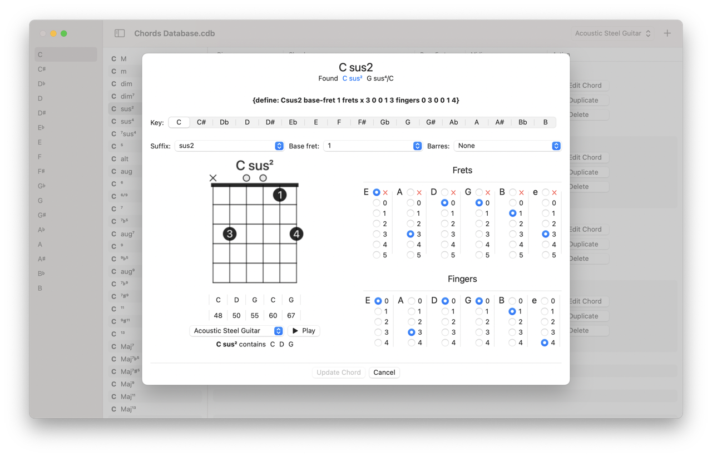

#  Chords Database

For my [Chord Provider](https://github.com/Desbeers/Chord-Provider) application, I use my [SwiftlyChordUtilities](https://github.com/Desbeers/SwiftlyChordUtilities) package.
It has a database with all the known chords for guitar, guitalele and ukule in a very simple JSON format.

This macOS and iPadOS application shows all those chords in a document and you can change them to your liking.

In the [SwiftlyChordUtilities](https://github.com/Desbeers/SwiftlyChordUtilities) package you can find them in the `Resources` folder with a `chordsdb` extension. This application can open them.

## The database is not perfect and I wrote this application to alter them

- A new file will start with a default database for your instrument.
- You can save your altered database in the **SwiftlyChordUtilities** *Database* format.
- And you can open it again.

## Limitations

- It will wil try to validate your chord but it is not always correct.

## Contribute

If you want to contribute to the database, clone [SwiftlyChordUtilities](https://github.com/Desbeers/SwiftlyChordUtilities), open the database you want to change and send a PR. I promise, It's fun to add chords!
